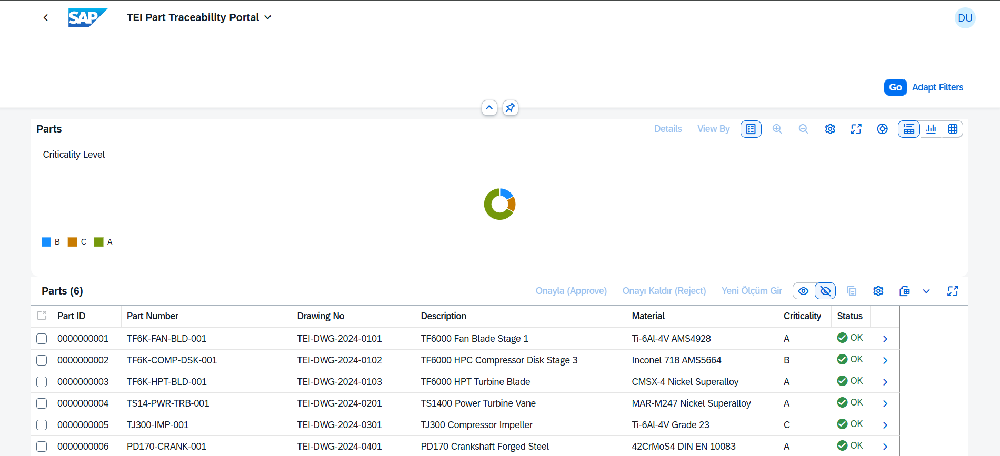

*[English](README.md) | [Türkçe](README.tr.md)*

# ✈️ TEI Part Traceability Portal

**A full-stack SAP Fiori / ABAP application for aerospace part genealogy, quality control, and automated compliance alerting.**

> Given a critical engine or aircraft part, answer in seconds: *"Which machine produced this part, which operator ran it, which CMM device inspected it, and did every measurement pass tolerance?"*

<!--
  📸 SCREENSHOT — Hero image
  Add a screenshot of the List Report (Parts list with the donut chart) here.
  Example: 
-->


---

## Table of Contents

- [Overview](#overview)
- [Key Features](#key-features)
- [Architecture](#architecture)
  - [Data Model](#data-model)
  - [OData Service](#odata-service)
  - [Business Logic: Automatic Tolerance Validation](#business-logic-automatic-tolerance-validation)
  - [Approve / Reject Workflow with Status Roll-Up](#approve--reject-workflow-with-status-roll-up)
  - [CDS View: Unified Production Timeline](#cds-view-unified-production-timeline)
  - [Frontend (SAP Fiori Elements)](#frontend-sap-fiori-elements)
- [Screenshots](#screenshots)
- [Tech Stack](#tech-stack)
- [Project Structure](#project-structure)
- [Getting Started](#getting-started)
- [Use Cases](#use-cases)
- [Known Limitations](#known-limitations)
- [Roadmap](#roadmap)

---

## Overview

In aerospace and defense manufacturing, every critical part needs a **digital ID card**: a complete, auditable record of everything that happened to it, from raw material intake to final quality sign-off. If a part fails in the field years later, engineers need to instantly trace back its entire production and inspection history.

**TEI Part Traceability Portal** is a demo/portfolio implementation of exactly that system, built on SAP's standard enterprise stack:

- **SAP Gateway (OData V2)** for the backend service layer
- **ABAP** with an object-oriented (OOP) quality validation engine
- **CDS Views** for consolidated, cross-table reporting
- **SAP Fiori Elements** for a zero-custom-code, annotation-driven UI

It's not just a CRUD app — it demonstrates a real **business rule enforcement loop**: a quality inspector submits a measurement, the system automatically validates it against engineering tolerances, and if it fails, the part is automatically flagged, blocked, and the responsible quality manager is notified by email — with no manual step in between.

---

## Key Features

| Feature | Description |
|---|---|
| 🔍 **Full Part Traceability** | Every part's raw material, machining operations, and quality inspection results are linked and queryable in one place. |
| 📊 **Analytical Dashboard** | List Report with a donut chart showing the real distribution of parts by criticality level (A/B/C), backed by a proper server-side aggregation (`GROUP BY`). |
| ✅ **Approve / Reject Workflow** | Parts, individual operations, and individual quality measurements can each be approved or rejected independently. |
| 🔗 **Automatic Status Roll-Up** | Rejecting *any* operation or quality measurement automatically flags the *parent part* as rejected — no manual bookkeeping required. |
| 🛑 **Automatic Tolerance Validation** | New quality measurements are checked against `Nominal ± Tolerance` by a dedicated ABAP OOP class. Out-of-tolerance entries are auto-failed. |
| 📧 **Automated Email Alerts** | An out-of-tolerance measurement automatically triggers an email to the quality manager via `CL_BCS` (SAP Business Communication Service) — no human has to notice the problem first. |
| 🧩 **CDS-Based Consolidated View** | A CDS View (published as its own OData service) merges operation history and quality results into a single chronological event stream per part — a foundation for timeline-style reporting. |
| ♻️ **Live Data Refresh** | The UI periodically re-synchronizes with the backend so that changes made via actions (which don't naturally propagate to sibling UI sections in Fiori Elements) become visible without a manual page reload. |

---

## Architecture

### Data Model

Three custom Z-tables form the backbone of the system:

```
ZTEI_PART_MASTER (1)───────────────┬───────────────(N) ZTEI_OPER_LOG
  PART_ID (key)                    │                     PART_ID (key)
  PART_NO                          │                     OPERATION_SEQ (key)
  DRAWING_NO                       │                     OPERATION_TYPE
  PART_DESCRIPTION                 │                     MACHINE_ID
  MATERIAL_SPEC                    │                     OPERATOR_ID
  CRITICALITY_LEVEL (A/B/C)        │                     START_DATE / END_DATE
  STATUS (OK / RJ)                 │                     OPER_RESULT (P/F)
  CREATION_DATE / CREATED_BY       │
                                   └───────────────(N) ZTEI_QUAL_RESULT
                                                         PART_ID (key)
                                                         TEST_SEQ (key)
                                                         DIMENSION_NAME
                                                         NOMINAL_VALUE
                                                         TOLERANCE_PLUS / MINUS
                                                         ACTUAL_VALUE
                                                         QUAL_RESULT (P/F)
                                                         CMM_DEVICE_ID
                                                         INSPECTOR_ID
                                                         MEASUREMENT_DATE
```

Each part (e.g. a turbine blade or compressor disk) has a **1-to-many** relationship with its own operation history and its own quality inspection results.

<!--
  📸 SCREENSHOT — SE11/SE16 table structure or data
  Example: 
-->

### OData Service

The service `ZTEI_PART_SRV_SRV` (OData V2, classic SAP Gateway / SEGW, MPC_EXT + DPC_EXT) exposes:

- **Entity sets:** `PartMasterSet`, `OperLogSet`, `QualStatusSet`
- **Navigation:** `PartMasterSet → OperLogs` and `PartMasterSet → QualResults` (1:N associations, correctly filtered server-side by `PartId`)
- **Custom bound actions:**
  | Action | Bound to | Purpose |
  |---|---|---|
  | `ApprovePart` / `RejectPart` | PartMaster | Manual sign-off at the part level |
  | `ApproveOperation` / `RejectOperation` | OperLog | Manual sign-off on a single operation step |
  | `ApproveQuality` / `RejectQuality` | QualStatus | Manual sign-off on a single quality measurement |
  | `SubmitQualityMeasurement` | PartMaster | Enter a **new** quality measurement — triggers automatic validation (see below) |

<!--
  📸 SCREENSHOT — SEGW / ADT service builder or metadata view
  Example: 
-->

### Business Logic: Automatic Tolerance Validation

This is the centerpiece of the application. Two ABAP OOP classes implement the actual engineering/quality logic:

**`ZCL_TEI_QUALITY_VALIDATOR`** — pure validation logic, no side effects:

```abap
CLASS zcl_tei_quality_validator DEFINITION PUBLIC FINAL CREATE PUBLIC.
  PUBLIC SECTION.
    TYPES: BEGIN OF ty_validation_result,
             is_within_tolerance TYPE abap_bool,
             deviation           TYPE ztei_qual_result-actual_value,
           END OF ty_validation_result.

    CLASS-METHODS check_tolerance
      IMPORTING
        iv_nominal_value   TYPE ztei_qual_result-nominal_value
        iv_tolerance_plus  TYPE ztei_qual_result-tolerance_plus
        iv_tolerance_minus TYPE ztei_qual_result-tolerance_minus
        iv_actual_value    TYPE ztei_qual_result-actual_value
      RETURNING
        VALUE(rs_result)   TYPE ty_validation_result.
ENDCLASS.
```

**`ZCL_TEI_QUALITY_NOTIFIER`** — sends an email via `CL_BCS` when a measurement fails, with no manual trigger required.

<!--
  📸 SCREENSHOT — SE24/ADT class view of ZCL_TEI_QUALITY_VALIDATOR / ZCL_TEI_QUALITY_NOTIFIER
  Example: 
-->

The flow, triggered by the `SubmitQualityMeasurement` action:

```
Quality inspector enters a new measurement (Actual Value)
              │
              ▼
  ZCL_TEI_QUALITY_VALIDATOR compares Actual vs. Nominal ± Tolerance
              │
    ┌─────────┴─────────┐
    ▼                    ▼
 Within tolerance    Out of tolerance
    │                    │
 Result = 'P'        Result = 'F'
                          │
                          ├─► Part status auto-rolled up to 'RJ' (Rejected)
                          └─► ZCL_TEI_QUALITY_NOTIFIER sends an alert email
                              to the quality manager, automatically
```

<!--
  📸 SCREENSHOT — "Submit Quality Measurement" dialog in Fiori, plus the resulting Fail row
  Example: 
-->

### Approve / Reject Workflow with Status Roll-Up

Approvals happen at three levels — part, operation, and quality measurement — and they're independent from each other on purpose: automatic validation flags an objective *system* result, while human Approve/Reject represents a **quality engineer's review**, which may confirm or deliberately override the system's finding (a realistic "engineering concession" scenario).

The one rule that *is* automated: **rejecting any child record (an operation or a quality measurement) immediately rolls the parent part's status up to Rejected.** This is implemented directly in the OData action handler (`DPC_EXT`), so there's no way for a rejected sub-record to hide inside an "OK" part.

<!--
  📸 SCREENSHOT — Object Page showing a rejected part with a red status, and its rejected child row
  Example: 
-->

### CDS View: Unified Production Timeline

Modeling a part's full history as *two separate tables* (operations and quality checks) works, but doesn't give a true chronological picture. A dedicated CDS View solves this with a `UNION`, treating both operations and quality checks as generic "events" on a shared timeline:

```sql
@AbapCatalog.sqlViewName: 'ZTEIPARTTRACV'
@AbapCatalog.compiler.compareFilter: true
@AccessControl.authorizationCheck: #CHECK
@EndUserText.label: 'TEI Part Full Traceability - Unified Event Timeline'
@OData.publish: true
define view ZTEI_I_PART_TRACE_EVT as
  select from ztei_oper_log as oper
    inner join ztei_part_master as part on part.part_id = oper.part_id
{
  key part.part_id                          as PartId,
  key oper.operation_seq                    as EventSeq,
      part.part_no                          as PartNo,
      cast( 'OPERATION' as abap.char( 10 ) ) as EventType,
      cast( oper.operation_type as abap.char( 50 ) ) as EventDescription,
      oper.machine_id                        as ResourceId,
      oper.operator_id                       as PersonId,
      oper.start_date                        as EventDate,
      cast( oper.oper_result as abap.char( 1 ) ) as EventResult
}
union
  select from ztei_qual_result as qual
    inner join ztei_part_master as part on part.part_id = qual.part_id
{
  key part.part_id                          as PartId,
  key qual.test_seq                         as EventSeq,
      part.part_no                          as PartNo,
      cast( 'QUALITY' as abap.char( 10 ) )    as EventType,
      cast( qual.dimension_name as abap.char( 50 ) ) as EventDescription,
      qual.cmm_device_id                     as ResourceId,
      qual.inspector_id                      as PersonId,
      qual.measurement_date                  as EventDate,
      cast( qual.qual_result as abap.char( 1 ) ) as EventResult
}
```

This view is published directly as its own OData service (`ZTEI_I_PART_TRACE_EVT_CDS`) via `@OData.publish: true` — no manual MPC/DPC classes required — and is independently consumable from any client (verified via SAP Gateway Client / plain OData `$metadata` and entity-set calls).

<!--
  📸 SCREENSHOT — ADT Data Preview of the CDS view, or the Gateway Client test result
  Example: 
-->

### Frontend (SAP Fiori Elements)

The UI is a **SAP Fiori Elements v2** application (SAPUI5 1.150, `sap_horizon` theme) — meaning almost the entire UI is generated from OData metadata + annotations, not hand-written screens:

- **Analytical List Page**: parts list + donut chart of criticality distribution.
- **Object Page**: General Information, Operation History, and Quality Results as three annotation-driven sections.
- `webapp/annotations/annotation.xml` drives everything: field labels, list columns, the chart definition, action buttons, and Object Page facets.
- A small `Component.js` extension periodically re-syncs the OData model, so that changes made through actions on a child entity (which Fiori Elements doesn't automatically propagate to the parent list) become visible without a manual refresh.

<!--
  📸 SCREENSHOT — Object Page with all 3 sections visible
  Example: 
-->

---

## Screenshots

Screenshots are placed inline throughout this document, right below the section they illustrate: the hero part list at the top, SE11/SE16 tables and SEGW/ADT metadata under [Architecture](#architecture), the OOP classes and the tolerance-violation flow under [Business Logic](#business-logic-automatic-tolerance-validation), the roll-up example under [Approve / Reject Workflow](#approve--reject-workflow-with-status-roll-up), the CDS preview under [CDS View](#cds-view-unified-production-timeline), the full Object Page under [Frontend](#frontend-sap-fiori-elements), and the SOST queued alert under [Known Limitations](#known-limitations). Replace each `docs/images/PLACEHOLDER-*.png` reference with your own screenshot of the same name.

---

## Tech Stack

**Backend**
- SAP NetWeaver AS ABAP (classic SAP Gateway / SEGW)
- OData V2 (`ZTEI_PART_SRV_SRV`)
- ABAP OOP (custom validation & notification classes)
- CDS Views (`@OData.publish`)
- `CL_BCS` (SAP Business Communication Service) for email

**Frontend**
- SAP Fiori Elements v2 (Analytical List Page + Object Page templates)
- SAPUI5 / OpenUI5 1.150.0
- OData V2 annotations (`UI.LineItem`, `UI.FieldGroup`, `UI.Facets`, `UI.Chart`, `UI.DataFieldForAction`)
- `@sap/ux-ui5-tooling`, `@ui5/cli`

---

## Project Structure

```
zteiparttrace/
├── webapp/
│   ├── Component.js              # App component + periodic model refresh
│   ├── index.html                # Standalone entry point
│   ├── manifest.json             # App descriptor: data sources, models, FE page config
│   ├── annotations/
│   │   └── annotation.xml        # All UI annotations (labels, chart, actions, facets)
│   ├── i18n/
│   │   └── i18n.properties
│   └── localService/
│       └── mainService/
│           └── metadata.xml      # Local OData metadata (used by fiori-tools during dev)
├── package.json
├── ui5.yaml                      # Real backend proxy config
├── ui5-local.yaml                # Local UI5 framework config
└── ui5-mock.yaml                 # Mock server config (dev only, no data by default)
```

> The ABAP backend (Z-tables, MPC_EXT/DPC_EXT classes, OOP classes, CDS view) lives in the connected SAP system, not in this repository — it's documented in the sections above for reference.

---

## Getting Started

**Prerequisites**
- Access to a SAP system with the `ZTEI_PART_SRV_SRV` OData service active and the backend objects described above implemented
- Node.js (LTS) and npm

**Run against the real SAP backend**

```bash
npm install
npm start
```

This proxies OData calls to the backend defined in `ui5.yaml` (`http://vhcalnplci:8000` by default — update this to your own system). Your browser will prompt for SAP logon credentials on first load.

> This project is intentionally configured to run **only against a real backend** — no mock data is shipped, by design (see [Known Limitations](#known-limitations)).

---

## Use Cases

- **Aerospace / defense manufacturing**: full genealogy of flight-critical parts (engine blades, disks, shafts) from raw material to final inspection.
- **Quality management demo**: shows a complete, closed-loop "detect → block → notify → review" cycle for out-of-tolerance measurements — a pattern applicable well beyond aerospace (automotive, medical devices, any regulated manufacturing).
- **SAP Fiori Elements / CDS learning reference**: a compact, real example of classic OData V2 development (MPC_EXT/DPC_EXT, bound actions, navigation with server-side filtering) combined with a modern CDS View exposed via `@OData.publish`.
- **Portfolio piece**: demonstrates ABAP OOP, OData service design, CDS Views, and Fiori Elements annotation-driven UI development in one connected example.

---

## Known Limitations

- **Email delivery depends on SAPconnect (SCOT) configuration.** The notification logic (`ZCL_TEI_QUALITY_NOTIFIER`) correctly builds and queues the alert email (verifiable in `SOST`), but actual internet delivery requires a working SMTP relay node in `SCOT`. On isolated/trial systems (e.g. the SAP NetWeaver trial box used during development), this queue step may fail with an *Internal Routing Error* — this is an infrastructure/Basis configuration gap, not an application defect.

  <!--
    📸 SCREENSHOT — SOST queued email alert
    Example: 
  -->

- **No literal "Timeline" widget in the main app.** A true `sap.m.Timeline` control embedded in the Fiori Elements Object Page was attempted, but ran into undocumented extensibility constraints in this SAPUI5 version's Smart Template implementation. Chronological data is available today via two separate tables (Operation History, Quality Results) and via the CDS-based unified event service, which is ready to be consumed by a timeline UI in the future.
- **No mock data is shipped.** The app is deliberately configured to run only against a live backend (see [Getting Started](#getting-started)).

---

## Roadmap

- [ ] Wire the CDS-based unified event view (`ZTEI_I_PART_TRACE_EVT_CDS`) into a proper `sap.m.Timeline` visualization
- [ ] Add authorization checks (`AUTHORITY-CHECK`) to the Approve/Reject/Submit actions
- [ ] Add a "concession / engineering waiver" reason field for manual overrides of failed measurements
- [ ] Explore a hybrid integration path (external quality device data ingestion via a microservice → OData)

---

<p align="center">Built as a hands-on SAP Fiori / ABAP learning & portfolio project.</p>
